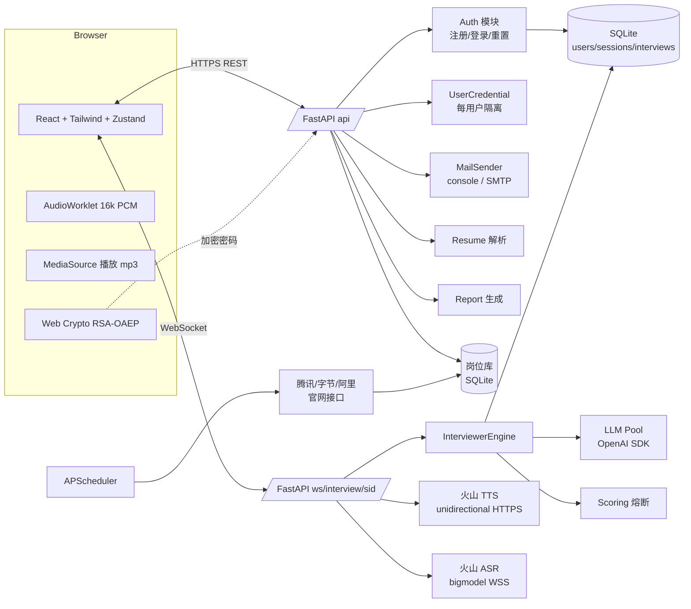

# QiInterview · 智能模拟面试系统

> 基于大模型 + 实时语音的端到端模拟面试 Web 应用。
> 前端浏览器录音上行、AI 面试官语音提问、逐轮动态追问与评分、结束后出复盘报告。

---

## 1. 产品概览

QiInterview 是一个**单体 Web 应用**，由 FastAPI 后端 + React 前端组成，部署到一台机器上即可运行，数据落 SQLite。主要工作流：

1. **注册 / 登录**（邮箱 + 密码 + OTP）
2. **凭据配置**：用户填入自己的 LLM Key 与火山引擎语音 Key，按用户隔离存储
3. **新建面试**：选面试类型（一面 / 二面 / 综合 / HR）→ 选岗位（大厂真实岗位库，或自定义 JD）→ 可选上传简历
4. **进行面试**：浏览器麦克风实时上行 → ASR 流式识别 → AI 面试官追问 → TTS 流式播报；支持用户抢话打断
5. **生成报告**：结束后出总结 / 亮点 / 不足 / 建议 + 逐轮点评 + 分数曲线
6. **历史管理**：所有面试记录可查可删

**定位**：个人练习 / 内部演示用，不面向多租户生产负载（SQLite + 单机）。

---

## 2. 架构总览



**核心技术栈**

| 层 | 技术 |
|---|---|
| 后端 | Python 3.11+ / FastAPI / SQLAlchemy 2.x (async) / Alembic / APScheduler / Pydantic v2 / Jinja2 |
| 数据库 | SQLite (aiosqlite) |
| LLM | OpenAI SDK 统一调用（通过 base_url 切换 doubao / deepseek / qwen / glm） |
| 语音 | 火山引擎 TTS `api/v3/tts/unidirectional`（HTTPS 流式）+ 火山引擎 ASR `api/v3/sauc/bigmodel_async`（WSS 流式） |
| 前端 | Vite + React 18 + TypeScript + Tailwind + 自研 shadcn 风格组件 + Zustand + React Router |
| 密码学 | RSA-OAEP(SHA-256) 传输加密 + PBKDF2-SHA256 存储哈希（均用 Python stdlib / `cryptography` 实现，无 bcrypt/argon2 依赖） |
| 测试 | pytest（后端接口）+ Playwright + pytest-playwright（E2E） |

---

## 3. 功能清单（与代码对齐）

### 3.1 账号与鉴权（[app/api/auth.py](file:///e:/works/codes/Python/Qoder/try2/QiInterview2/backend/app/api/auth.py)）

- **邮箱主身份**：用户名退化为可选昵称，登录标识为邮箱
- **两步注册**：`POST /register/start`（发 OTP 邮件）→ `POST /register/verify`（校验 6 位 OTP + 设置密码）
- **登录 / 登出**：`POST /login`，`POST /logout`，身份凭证为 HttpOnly Cookie（`qi_session`，30 天 TTL）
- **当前用户**：`GET /me`
- **忘记密码**：`POST /password-reset/start`（发重置链接邮件）→ `POST /password-reset/confirm`
- **RSA 密钥分发**：`GET /pubkey` 返回服务端公钥，前端用 Web Crypto 以 RSA-OAEP(SHA-256) 加密密码后再发，后端解密后 PBKDF2 哈希入库
- **票据安全**：OTP / 重置 token 原文**不入库、不入日志**，只存 SHA-256 哈希；一次性消费
- **邮件发送**：`MAIL_BACKEND=console`（默认，落 `backend/data/dev_mail/*.json`）或 `smtp`（真实 SMTP，支持 `starttls` / `ssl`）

### 3.2 用户凭据（[app/api/credentials.py](file:///e:/works/codes/Python/Qoder/try2/QiInterview2/backend/app/api/credentials.py)）

- 业务代码运行时从 `UserCredential` 表按 `current_user` 读取，不回退读 `.env`（`.env` 里的 Key 仅 E2E 脚本使用）

### 3.3 岗位库（[app/services/jobs/](file:///e:/works/codes/Python/Qoder/try2/QiInterview2/backend/app/services/jobs)，[app/api/jobs.py](file:///e:/works/codes/Python/Qoder/try2/QiInterview2/backend/app/api/jobs.py)）

- 抓取来源：**腾讯招聘 / 字节跳动 / 阿里巴巴** 官网公开接口（见 `tencent.py` / `bytedance.py` / `alibaba.py`）
- `GET /jobs`：按关键词 + 公司筛选
- `POST /jobs/refresh`：手动触发抓取
- **定时刷新**：APScheduler 后台任务，默认 6 小时（`JOBS_REFRESH_INTERVAL_HOURS`），启动时若岗位表为空会自动预热
- **缓存**：`expires_at` 控制过期；唯一约束 `(source, source_post_id)` 去重

### 3.4 面试会话（[app/api/interview.py](file:///e:/works/codes/Python/Qoder/try2/QiInterview2/backend/app/api/interview.py)）

- `POST /interviews`：创建会话；接收 `interview_type` / `eval_mode` / `job_id` 或自定义 JD / `resume_text` / 凭据选择
- 创建时同步调用 LLM 算 **印象分**（60–80 区间），并写入 `impression_breakdown`
- 四种面试类型：`tech1`（一面）/ `tech2`（二面）/ `comprehensive`（综合）/ `hr`，分别对应不同系统提示词与音色
- 两种评价模式：`realtime`（每轮作答后实时评分并可能熔断）/ `summary`（仅结束后汇总）
- `GET /interviews`：当前用户的历史列表
- `GET /interviews/{sid}` / `DELETE /interviews/{sid}` / `DELETE /interviews`（清空全部）
- `POST /interviews/{sid}/end`：结束面试

### 3.5 简历上传（[app/api/resume.py](file:///e:/works/codes/Python/Qoder/try2/QiInterview2/backend/app/api/resume.py)）

- `POST /resume/upload`：上传 PDF → 后端用 `pypdf` 抽文本 → LLM 结构化摘要供后续追问引用
- 简历文本按会话持久化（`InterviewSession.resume_text`）

### 3.6 面试过程（[app/api/voice_ws.py](file:///e:/works/codes/Python/Qoder/try2/QiInterview2/backend/app/api/voice_ws.py) + [app/services/interviewer.py](file:///e:/works/codes/Python/Qoder/try2/QiInterview2/backend/app/services/interviewer.py)）

WebSocket：`WS /ws/interview/{sid}`

- **开场白**：客户端发 `start` 后由 LLM 生成 + TTS 合成
- **用户语音上行**：`AudioWorklet` 重采样至 16kHz / 16bit / mono，base64 分片经 WS 推给后端，后端透传到火山 ASR
- **文本回退**：不开麦场景可发 `answer_text` 走纯文本
- **AI 决策**：`InterviewerEngine` 按模板（`prompts/round_question.j2` 等）选择追问策略（广度 breadth / 深度 depth）
- **评分与熔断**：realtime 模式每轮算 `score_delta`；分数低于 `score_threshold_break`（默认 50）时触发 `ai_interrupt` 结束
- **用户抢话打断**：客户端本地 RMS VAD 检测 → 发 `user_interrupt` → 服务端取消进行中 TTS 任务并中止 MediaSource
- **答题超时保护**：单轮超过 `max_user_answer_seconds`（默认 90s）自动结束

#### WebSocket 协议（已在 [voice_ws.py](file:///e:/works/codes/Python/Qoder/try2/QiInterview2/backend/app/api/voice_ws.py) 实现的事件）

```jsonc
// Client → Server
{"type":"start"}
{"type":"audio_chunk","pcm_base64":"..."}       // 16k mono Int16 base64
{"type":"answer_text","text":"..."}
{"type":"end_turn"}
{"type":"user_interrupt"}
{"type":"end_interview"}

// Server → Client
{"type":"ai_thinking"}
{"type":"ai_text","text":"...","strategy":"breadth|depth"}
{"type":"ai_audio","mime":"audio/mp3","chunk_b64":"..."}
{"type":"ai_audio_end","interrupted":false}
{"type":"stt_partial","text":"..."}
{"type":"stt_final","text":"...","turn_idx":5}
{"type":"score_update","turn_idx":5,"delta":-3,"total":71,"evaluator":{...}}
{"type":"ai_interrupt","reason":"off_topic|score_threshold"}
{"type":"interview_end","reason":"user|score_threshold|complete"}
{"type":"error","message":"..."}
```

### 3.7 报告（[app/api/reports.py](file:///e:/works/codes/Python/Qoder/try2/QiInterview2/backend/app/api/reports.py) + [app/services/report.py](file:///e:/works/codes/Python/Qoder/try2/QiInterview2/backend/app/services/report.py)）

- `GET /reports/{sid}`：返回结构化报告（summary / strengths / weaknesses / advice / score_explanation / trend）
- `GET /reports/{sid}/stream`：SSE 流式推送生成过程
- `DELETE /reports/{sid}`
- 报告由 LLM 按 `prompts/final_report.j2` 生成，分数曲线来自 `Turn.score_after` 序列

### 3.8 传输与部署安全（[app/main.py](file:///e:/works/codes/Python/Qoder/try2/QiInterview2/backend/app/main.py)）

- `TrustedHostMiddleware`：prod 模式下 Host header 白名单
- `SecurityHeadersMiddleware`：所有环境都加 `X-Content-Type-Options` / `Referrer-Policy` / `X-Frame-Options`；prod 追加 HSTS 一年期 + 基础 CSP
- `CORSMiddleware`：`allow_credentials=True`，因此 prod 禁止 `*`
- **启动期硬校验**：`APP_ENV=prod` 时，若 `COOKIE_SECURE=False`、`ALLOWED_HOSTS` 含 `*`、`CORS_ORIGINS` 含 `*` 任一成立，直接 `RuntimeError` 拒绝启动

### 3.9 前端页面（[frontend/src/pages/](file:///e:/works/codes/Python/Qoder/try2/QiInterview2/frontend/src/pages)）

| 路由 | 页面 | 说明 |
|---|---|---|
| `/login` | LoginPage | 邮箱 + 密码登录 |
| `/register` | RegisterPage | 两步注册（邮箱 → OTP → 密码） |
| `/forgot-password` | ForgotPasswordPage | 发送重置链接 |
| `/reset-password` | ResetPasswordPage | 凭 token 设置新密码 |
| `/setup` | SetupPage | 凭据配置 / 选岗位 / 选类型 / 上传简历 |
| `/interview/:sid` | InterviewPage | 实时语音面试主界面 |
| `/report/:sid` | ReportPage | 复盘报告（分数曲线 + 逐轮展开） |
| `/history` | HistoryPage | 面试历史列表 |

---

## 4. 目录结构

```
QiInterview2/
├── backend/
│   ├── app/
│   │   ├── api/             # auth / credentials / interview / jobs / resume / reports / voice_ws
│   │   ├── core/            # auth_dep / credentials 透传 / passwords / rsa_keys / voice_router
│   │   ├── db/              # async engine + session
│   │   ├── models/          # User / Session / EmailVerification / UserCredential / InterviewSession / Turn / Report / JobPost
│   │   ├── prompts/         # 9 个 .j2 模板（opening / round_question / evaluator / final_report / ...）
│   │   ├── schemas/         # Pydantic v2 DTO
│   │   ├── services/        # interviewer / llm(+pool +mock) / tts(+pool) / stt / voice_protocol
│   │   │                    #   / scoring / report / resume_parser / mail / jobs/（大厂抓取 + 调度器）
│   │   ├── config.py        # Settings + APP_ENV 硬校验
│   │   └── main.py          # create_app / lifespan / 中间件
│   └── alembic/             # 迁移
├── frontend/
│   └── src/
│       ├── pages/           # 8 个页面（见 §3.9）
│       ├── components/      # AppShell / RequireAuth / JobPicker / ScoreChart / WaveAnimation / ui/
│       ├── lib/             # api / audioCapture / audioPlayer / ws / crypto
│       └── store/           # zustand 持久化设置
├── scripts/
│   ├── dev.ps1              # Windows 本地一键启动
│   └── e2e.ps1              # 仅打开浏览器提示（非测试入口）
├── tests/
│   ├── backend/             # pytest 接口测试
│   └── e2e/
│       ├── test_e2e_qiinterview.py   # Playwright 严格 E2E 主套件（30+ 用例）
│       ├── test_phase5_security_voice.py
│       ├── conftest.py               # 自动注册 e2e_default 用户 + RSA 加密 + Cookie 注入
│       └── README_TEST.md
├── docs/SECURITY.md
├── .env.example
└── README.md
```

---

## 5. 凭据配置

复制 `.env.example` 为 `.env.local`（在仓库根目录）。两类字段：

### 5.1 业务凭据（**仅 E2E 脚本读取**，业务代码不回退读）

| 名称 | 说明 | 获取入口 |
|---|---|---|
| `ARK_API_KEY` | LLM Key（豆包 / 方舟） | https://console.volcengine.com/ark |
| `LLM_PROVIDER` | `doubao` / `deepseek` / `qwen` / `glm` | — |
| `LLM_MODEL` / `LLM_MODEL_FAST` / `LLM_MODEL_DEEP` | 模型档位（Fast 用于出题打分、Deep 用于复盘报告） | — |
| `VOLC_VOICE_KEY` | 火山引擎语音单 X-Api-Key（TTS + ASR 共用） | https://console.volcengine.com/speech/app |

> 运行时真实入口：浏览器 [SetupPage](file:///e:/works/codes/Python/Qoder/try2/QiInterview2/frontend/src/pages/SetupPage.tsx) 表单填入 → `PUT /api/credentials` 写入 `UserCredential` 表。

### 5.2 服务侧偏好（业务代码读取）

- `BACKEND_HOST` / `BACKEND_PORT`（默认 `127.0.0.1:8000`）
- `DATABASE_URL`（默认 `sqlite+aiosqlite:///./data/qiinterview.db`）
- `JOBS_REFRESH_INTERVAL_HOURS`（默认 6）
- `APP_ENV` / `COOKIE_SECURE` / `ALLOWED_HOSTS` / `CORS_ORIGINS`
- `MAIL_BACKEND` + `SMTP_*` + `MAIL_FROM` + `FRONTEND_BASE_URL`（发邮件用）
- `VOLC_VOICE_TECH1` / `_TECH2` / `_COMPREHENSIVE` / `_HR`（按面试类型覆盖默认音色）

---

## 6. 本地启动

### 6.1 一键启动（Windows PowerShell）

```powershell
./scripts/dev.ps1
```

会分别开两个 PowerShell 窗口启动后端（`127.0.0.1:8000`）与前端（`127.0.0.1:5173`）。

### 6.2 手动

```powershell
# 后端
cd backend
python -m venv .venv
. .venv/Scripts/Activate.ps1
pip install -e .
alembic upgrade head
uvicorn app.main:app --host 127.0.0.1 --port 8000 --reload

# 前端（另开窗口）
cd frontend
npm install
npm run dev
```

打开 http://127.0.0.1:5173 ：注册账号 → 填凭据 → 选岗位 → 开始面试。

---

## 7. 测试

### 7.1 后端接口测试

```powershell
cd backend
pip install -e .[dev]
pytest -q ../tests/backend
```

覆盖：健康检查、鉴权（注册 / 登录 / 重置）、E2E 接口编排、语音协议、流式端点、传输安全。

### 7.2 端到端测试

```powershell
pip install -r tests/e2e/requirements-test.txt
playwright install chromium
pytest tests/e2e/test_e2e_qiinterview.py -v -s
```

- 真实浏览器 + 真实 LLM Key + 真实火山语音 Key（**不允许 mock**，详见 [tests/e2e/README_TEST.md](file:///e:/works/codes/Python/Qoder/try2/QiInterview2/tests/e2e/README_TEST.md)）
- 麦克风用 Chromium `--use-file-for-fake-audio-capture` 喂 [tests/e2e/fixtures/intro.wav](file:///e:/works/codes/Python/Qoder/try2/QiInterview2/tests/e2e/fixtures)
- 覆盖 6 大类 30+ 用例：Setup / Interview / Report / History / Performance / Security

> `scripts/e2e.ps1` **仅用于打开浏览器走手动 playbook**，不是自动测试入口。

---

## 8. 生产部署要点

- 必填 `.env.local`：`APP_ENV=prod` / `COOKIE_SECURE=true` / 显式 `ALLOWED_HOSTS` / 显式 `CORS_ORIGINS` / `MAIL_BACKEND=smtp` + `SMTP_*` + `FRONTEND_BASE_URL`（公网 HTTPS）
- 任一缺失 → `create_app` 启动时直接 `RuntimeError`
- 反向代理（nginx / caddy）终止 TLS；HSTS / CSP 由 `SecurityHeadersMiddleware` 在 prod 自动追加
- SQLite 适合个人 / 演示；真生产应换 PostgreSQL 并把 `DATABASE_URL` 改为 `postgresql+asyncpg://`
- 详见 [docs/SECURITY.md](file:///e:/works/codes/Python/Qoder/try2/QiInterview2/docs/SECURITY.md)

---

## 9. 已知限制与设计取舍

- **存储形态**：SQLite 单文件，不支持多进程 / 多节点；无读写分离
- **API Key 落库**：`UserCredential` 当前以明文存 SQLite，安全性依赖文件系统权限（目标是"个人使用"）；公网多用户部署需加 KMS
- **岗位来源**：仅腾讯 / 字节 / 阿里三家官网接口，其它公司需自行实现 `services/jobs/` 下的 `BaseFetcher`
- **语音供应商**：绑定火山引擎（新接口 `unidirectional` + `bigmodel_async`），更换 TTS/STT 供应商需改 `services/tts.py` 与 `services/stt.py`
- **LLM 供应商**：通过 OpenAI SDK `base_url` 切换；新增供应商需确保其 Chat Completions 兼容
- **实时评分**：依赖 LLM 稳定返回 JSON，历史实现过 JSON 解析降级但不保证 100% 成功
- **语音延迟**：端到端（用户停说 → AI 声音出来）目标 <1s，实测受 LLM 与 TTS 首块影响通常 1.5–3s，README_TEST 里标记为"产品真实性能缺陷"而非测试问题

---

Powered by Volcengine Doubao &amp; Speech · v0.4
